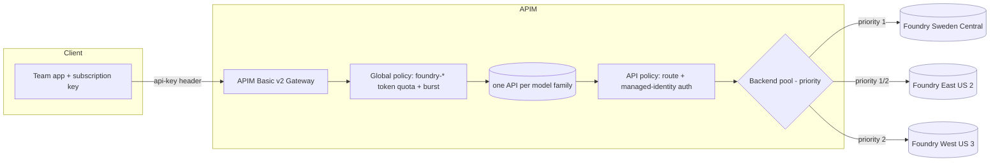

# Architecture

## Objective

A scalable APIM front door for Foundry model access with:

- **Product-based entitlement isolation** — products group model access; teams
  receive subscription keys against a product.
- **Per-subscription-key quota isolation** — each key has an independent token
  budget and burst guardrail enforced in policy.

## Scale model

| Dimension | Baseline (prod) | Dev sample |
| --- | --- | --- |
| Products | 80 (`p1..p80`) | 10 |
| Subscriptions / product | 10 | 5 |
| Total subscription keys | **800** | 50 |
| Lifetime-style token cap / key | 2,050,000 | 2,050,000 |
| Theoretical ceiling | **1.64B tokens** (800 x 2.05M) | 102.5M |
| Burst guardrail / key | 25,000 TPM | 25,000 TPM |
| APIM tier | Basic v2 | Basic v2 |
| APIM APIs | 5 (one per model family) | 5 |

Both counts are **parameterised** (`productCount`, `subscriptionsPerProduct`) and
changed by editing the parameters file and re-running deploy or
`06-create-products-and-subscriptions.ps1`.

## Foundry deployment topology

One deployment per model per region. Capacities are parameterised (`capacities`).

| Model family | Sweden Central | East US 2 | West US 3 |
| --- | --- | --- | --- |
| gpt-5-nano | priority 1 | priority 1 | priority 2 |
| gpt-5-mini | priority 1 | priority 1 | priority 2 |
| gpt-5.2 | priority 1 | priority 2 | — |
| gpt-5.4 | priority 1 | priority 2 | — |
| text-embedding-3-large | priority 1 | — | — |

> Foundry TPM/RPM quota is **regional, per-subscription, per-model/deployment-type**
> (Microsoft Learn: *Azure OpenAI quotas and limits*). Spreading deployments across
> regions increases total usable throughput per subscription.

## APIM object model

### Request flow

1. Client calls `https://<apim>.azure-api.net/<apiPath>/deployments/<deployment>/chat/completions?api-version=...`
   with the subscription key in the `api-key` header.
2. **Global policy** (service scope) checks `context.Api.Name` starts with
   `foundry-`; if so it applies `llm-token-limit` keyed on
   `context.Subscription.Id` (one shared counter across all foundry APIs for that
   key): lifetime-style token quota + 25K TPM burst, and emits telemetry headers
   (`x-tokens-consumed`, `x-tokens-remaining-quota`, `x-tokens-remaining-minute`).
3. **API policy** forces `stream_options.include_usage=true` for streaming chat
   requests, routes to the model family **backend pool** via
   `set-backend-service backend-id`, and authenticates to Azure OpenAI with APIM's
   **managed identity** (`authentication-managed-identity` -> bearer token). No
   keys are stored.
4. The **backend pool** selects a member by priority; **circuit breakers** on each
   member trip on 429/5xx and shift traffic to the next-priority region, honouring
   `Retry-After`.

## Identity & secrets

- APIM uses a **system-assigned managed identity**, granted **Cognitive Services
  User** on every Foundry account (`modules/rbac-cognitiveservices.bicep`).
- No API keys are placed in policy, parameters, or named values.
- Subscription keys are generated by APIM and retrieved at runtime via
  `listSecrets` only when needed by tests.

## Naming conventions

| Object | Pattern | Example |
| --- | --- | --- |
| API | `foundry-<family>-api` | `foundry-gpt5-nano-api` |
| Backend (regional) | `be-<familyKey>-<regionKey>` | `be-gpt5-nano-swc` |
| Backend pool | `pool-foundry-<family>` | `pool-foundry-gpt5-nano` |
| Product | `p<n>` | `p1` |
| Subscription | `p<n>subscriptionteam<m>` | `p1subscriptionteam1` |

## Primary Microsoft Learn references

- APIM v2 tiers overview — `/azure/api-management/v2-service-tiers-overview`
- APIM backends (pools, circuit breaker, priority) — `/azure/api-management/backends`
- `llm-token-limit` policy — `/azure/api-management/llm-token-limit-policy`
- `quota-by-key` policy — `/azure/api-management/quota-by-key-policy`
- `set-backend-service` policy — `/azure/api-management/set-backend-service-policy`
- `authentication-managed-identity` policy — `/azure/api-management/authentication-managed-identity-policy`
- Foundry/OpenAI quotas (regional) — `/azure/ai-foundry/openai/quotas-limits`
- CognitiveServices accounts/deployments schema — `/azure/templates/microsoft.cognitiveservices/accounts`
- APIM service schema — `/azure/templates/microsoft.apimanagement/service`
